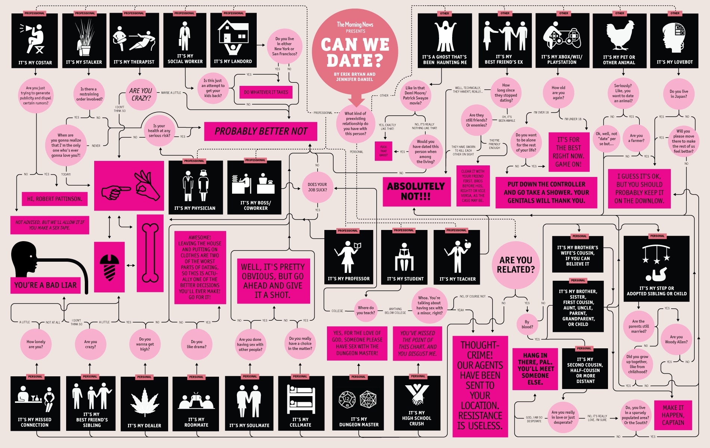

# ExpertSystem

This simple expert system decides if you can date someone based on schematic shown below. It uses *python3* with *clipspy* to control CLIPS.

## Setup
Install `Tkinter` (depending on platform):

Ubuntu/Debian: `sudo apt-get install tk-dev`

Arch/Manjaro: `sudo pacman -S tk`

To setup project you need to run:

`pip3 install -r requirements.txt`

## Run

- `cd` into `sources` and run `python3 gui.py`

or

- just run `python3 sources/gui.py`

or

- `make setup`

### Authors

- Łukasz Kania, 148077
- Mateusz Stawski, 147470
